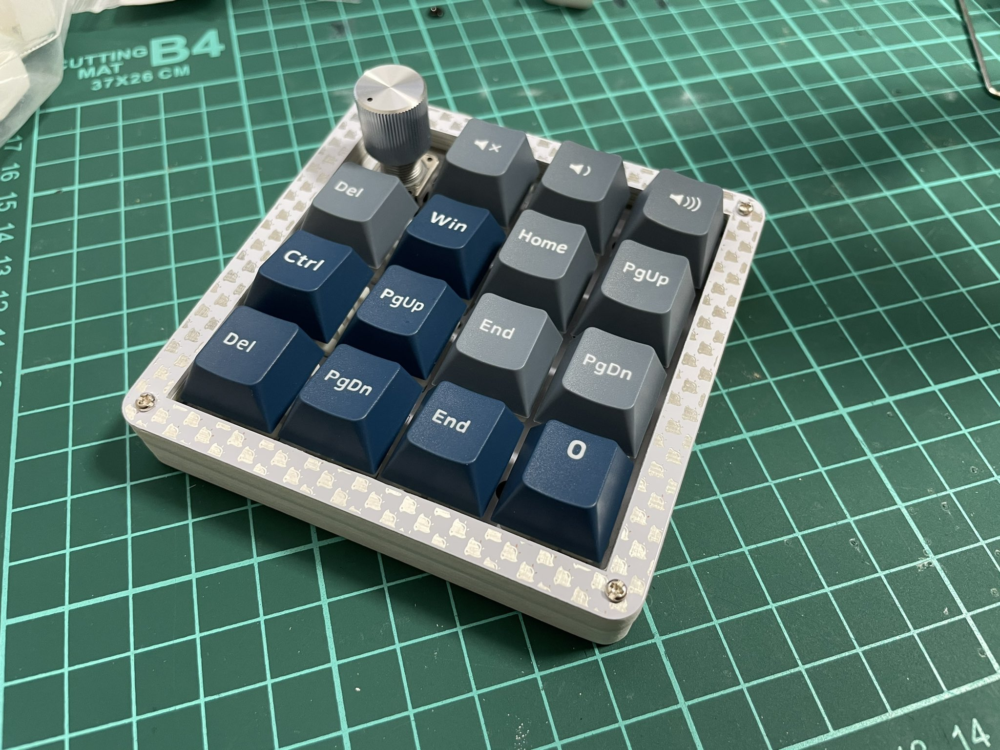

# Kasumigasane

## What is the Kasumigasane?

The Kasumigasane is a simple 16-key keypad that can be assembled without diodes.

The *Kasumigasane* (霞襲) means "a layer of misty stuff", because it is made of layers of glass exposi substrates.

## Customizability

You can replace the frame with a pattern of your choice.

The rightmost column and the lowermost row can use the 2U key.

The upper leftmost key can be replaced by a rotary encoder.

## Link

[Hardware data (PCB)](pcb/)

[Firmware](https://github.com/e3w2q/qmk_firmware/tree/e3w2q/keyboards/e3w2q/kasumigasane)

[PCBの入手方法](doc/pcb_order_guide_jp.md)

[パーツリスト](doc/bom_list_jp.md)

[ビルドガイド](doc/readme_jp.md)

