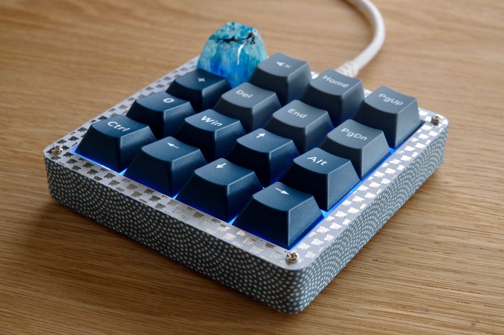
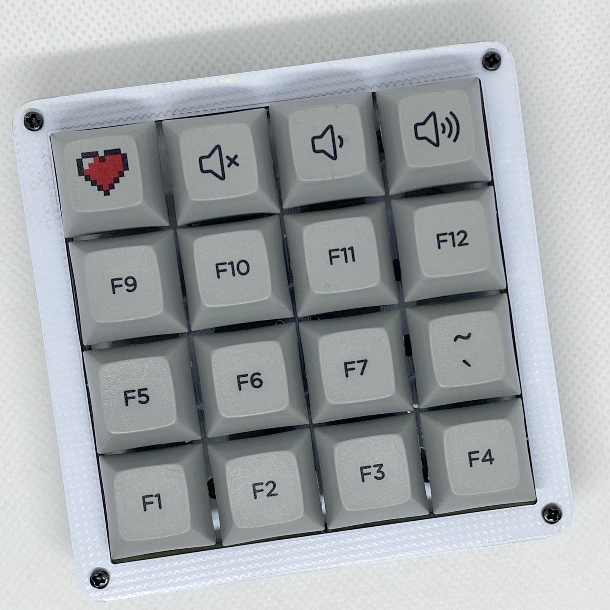

# Kasumigasane

## What is Kasumigasane?

Kasumigasane is a simple 16-key keypad that can be assembled without diodes.

*Kasumigasane* (霞襲) means "a layer of misty stuff", because it is made of layers of glass exposi substrates.

## Customizability

You can choose a frame from eight different patterns.

You can decorate the sides with 15mm wide masking tape.

The rightmost column and the lowermost row can use the 2U key.

The upper leftmost key can be replaced by a rotary encoder.

Backlight LED can be soldered.

## Link

[Hardware data (PCB)](pcb/)

[Firmware](https://github.com/e3w2q/qmk_firmware/tree/e3w2q/keyboards/e3w2q/kasumigasane)

[PCBの入手方法](doc/pcb_order_guide_jp.md)

[パーツリスト](doc/bom_list_jp.md)

[ビルドガイド](doc/readme_jp.md)

## Photos

<small>Photo by @otahinosame</small>

<small>Photo by @k2\_\_\_\_\_\_\_\_\_\_\_</small>

