# 霞襲 ビルドガイド

<!-- TOC -->

- [霞襲 ビルドガイド](#霞襲-ビルドガイド)
    - [必要なパーツ](#必要なパーツ)
    - [使用する道具、消耗品](#使用する道具消耗品)
    - [組み方の選択](#組み方の選択)
    - [ビルドガイド](#ビルドガイド)
        - [Pro Microのもげ防止加工](#pro-microのもげ防止加工)
        - [基板のカット](#基板のカット)
        - [基板側面のヤスリがけ](#基板側面のヤスリがけ)
        - [はんだ付けのイメージトレーニング](#はんだ付けのイメージトレーニング)
        - [土台の組み立て](#土台の組み立て)
        - [Pro Microの取り付け](#pro-microの取り付け)
        - [ダイオードの取り付け](#ダイオードの取り付け)
        - [バックライト用LEDの取り付け（バックライトで光らせたい場合のみ）](#バックライト用ledの取り付けバックライトで光らせたい場合のみ)
        - [ロータリーエンコーダの取り付け（ロータリーエンコーダを使いたい場合のみ）](#ロータリーエンコーダの取り付けロータリーエンコーダを使いたい場合のみ)
        - [スタビライザーの取り付け（2Uキーを使いたい場合のみ）](#スタビライザーの取り付け2uキーを使いたい場合のみ)
        - [キースイッチの取り付け](#キースイッチの取り付け)
        - [枠の組み立て](#枠の組み立て)
        - [マスキングテープの貼り付け](#マスキングテープの貼り付け)
        - [Pro Microの再取り付け](#pro-microの再取り付け)
        - [カプトンテープの貼り付け（任意）](#カプトンテープの貼り付け任意)
        - [キーキャップの取り付け](#キーキャップの取り付け)
        - [ゴム足の取り付け](#ゴム足の取り付け)
        - [ファームウェアの書き込み](#ファームウェアの書き込み)
    - [トラブルシューティング](#トラブルシューティング)

<!-- /TOC -->

## 必要なパーツ

[霞襲 パーツリスト](bom_list_jp.md)をご覧ください。

## 使用する道具、消耗品

[使用する道具、消耗品](tool_guide_jp.md)におすすめの道具類、注意事項等をまとめましたのでご覧ください。

## 組み方の選択

右端の1列、一番下の1行は、スタビライザーを付けて2Uキーが取り付けできます。

左上のキーをロータリーエンコーダに置き換えできます。ただし、バックライトとの併用はできません。

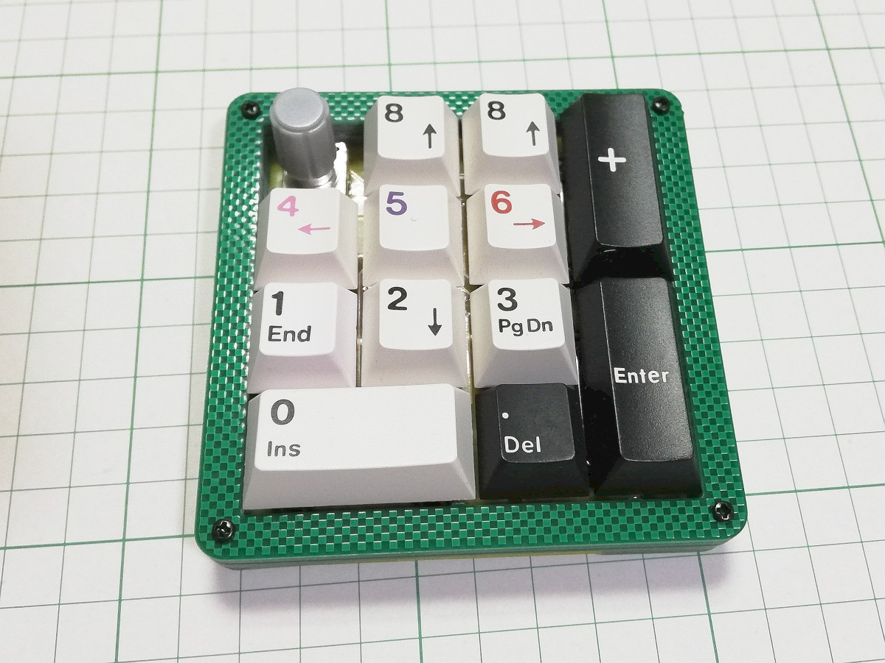

LEDを取り付けて、バックライトで光らせることができます。ただし、ロータリーエンコーダとの併用はできません。

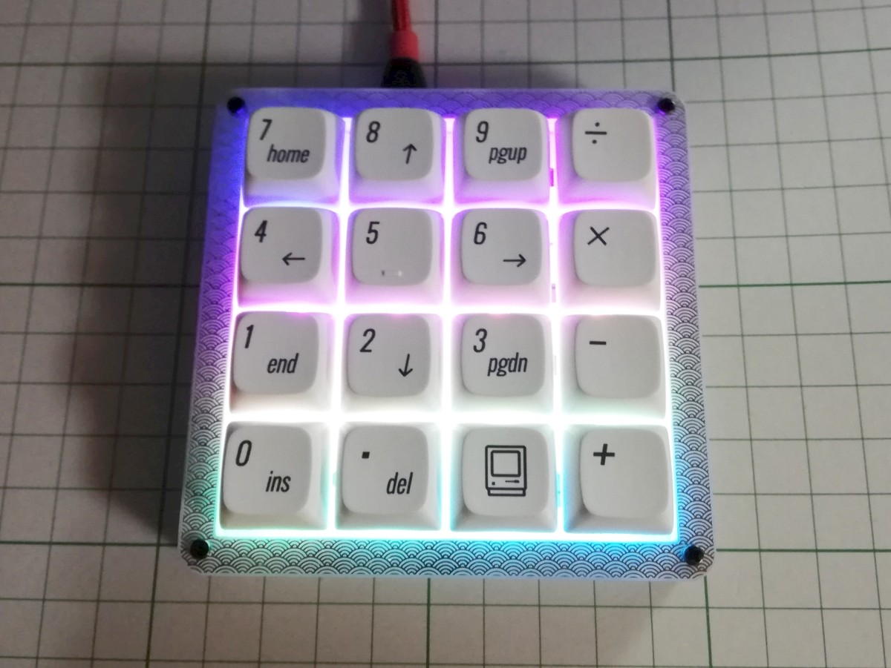

## ビルドガイド

### Pro Microのもげ防止加工

Pro Microにエポキシ接着剤を盛って、簡単にはもげないようにします。

参考1:[ProMicroのモゲ防止ついでにQMK_Firmwareを書き込む - Qiita](https://qiita.com/hdbx/items/2f3e4ddfcadda2a5578e)
参考2:[もげ予防 - Self-Made Keyboards in Japan](https://scrapbox.io/self-made-kbds-ja/%E3%82%82%E3%81%92%E4%BA%88%E9%98%B2)

エポキシ接着剤の2液を混ぜます。

接着剤を付け始める前にMicro USBコネクタを横から見てください。側面に穴が開いています。この穴に接着剤が入ると端子が入らなくなったり、入りにくくなったりします。

この穴を避けて、つまようじなどで接着剤を盛っていきます。

乾くまで置いておきます。

### 基板のカット

基板の細い部分をニッパーで切断し、各パーツに分けます。パーツや欠片が飛びますので、袋に入れながら行うなど、注意してカットしてください。
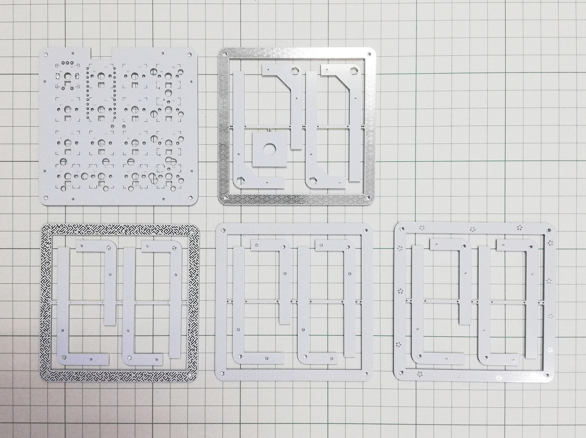

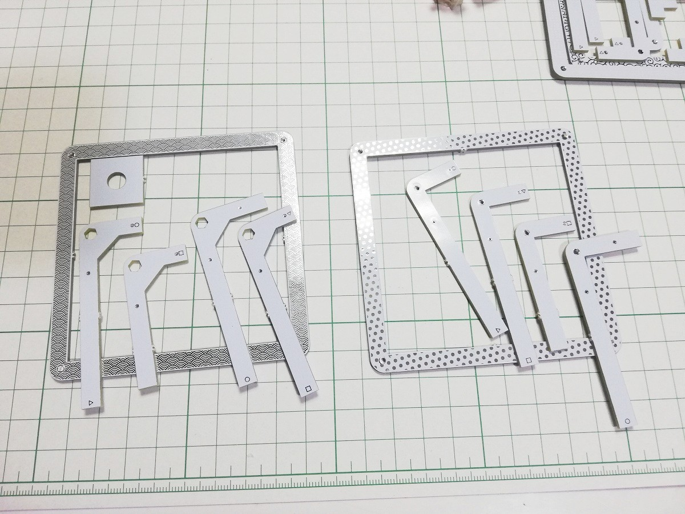

### 基板側面のヤスリがけ

基板の側面のバリをヤスリで整えます。紙ヤスリの場合、机の角に置き、その上でヤスリがけします。

### はんだ付けのイメージトレーニング

はんだ付けに慣れている方は次の項に進んでください。

全くはんだ付けをしたことがなかったり、数年ぶりにはんだ付けをする場合は、以下の動画が参考になります。

- [はんだ付けの詳細.m2p - YouTube](https://www.youtube.com/watch?v=ZA-ehWjRfYM)

- [基礎からわかる！自キ入門講座 第8回「自作キーボードのつくりかた #2」 - YouTube](https://www.youtube.com/watch?v=LOC53FeU-QM&t=999)

### 土台の組み立て

下の図のとおり重ねたいので、以下の指示に従って**上側から逆向きに**重ねていきます。
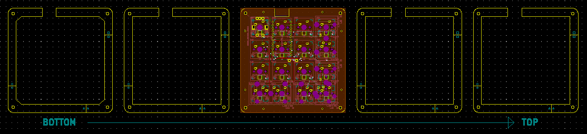

まずはD1～D4を下の写真のとおり並べます。
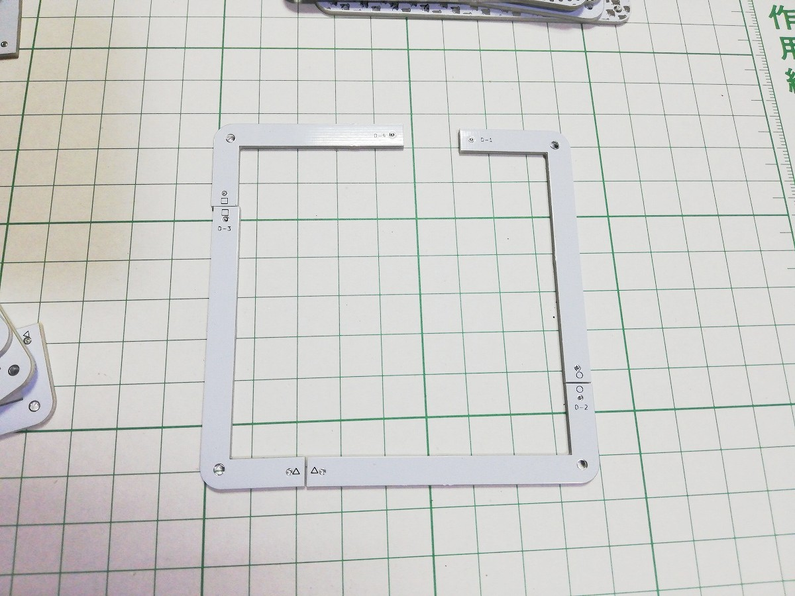

その上にC1～C4を並べます。

その上に基板を裏向きで置きます。
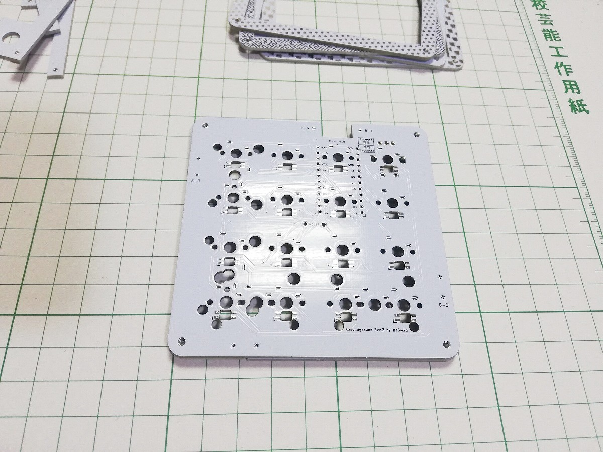

その上にA1～A4を並べます。

その上に何も書かれていない土台パーツを下の写真のとおり並べます。
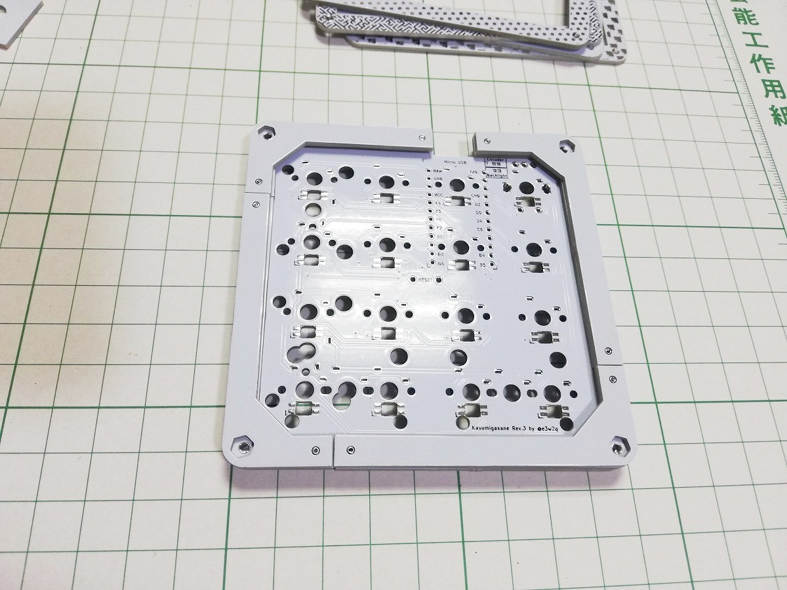

Pro Micro付属のピンヘッダを1本カットし、プラスチック部分を片側にずらします。
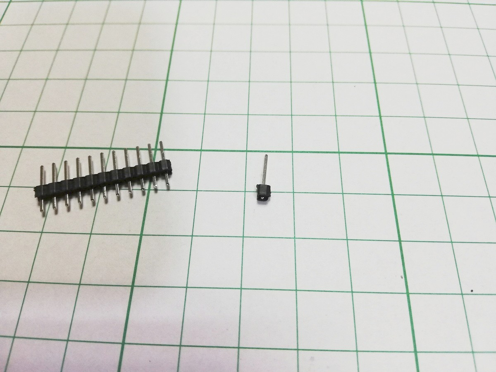

ニッパーで、プラスチック部分のキワでカットします。針金部分を使うので、飛ばないように注意してカットしてください。
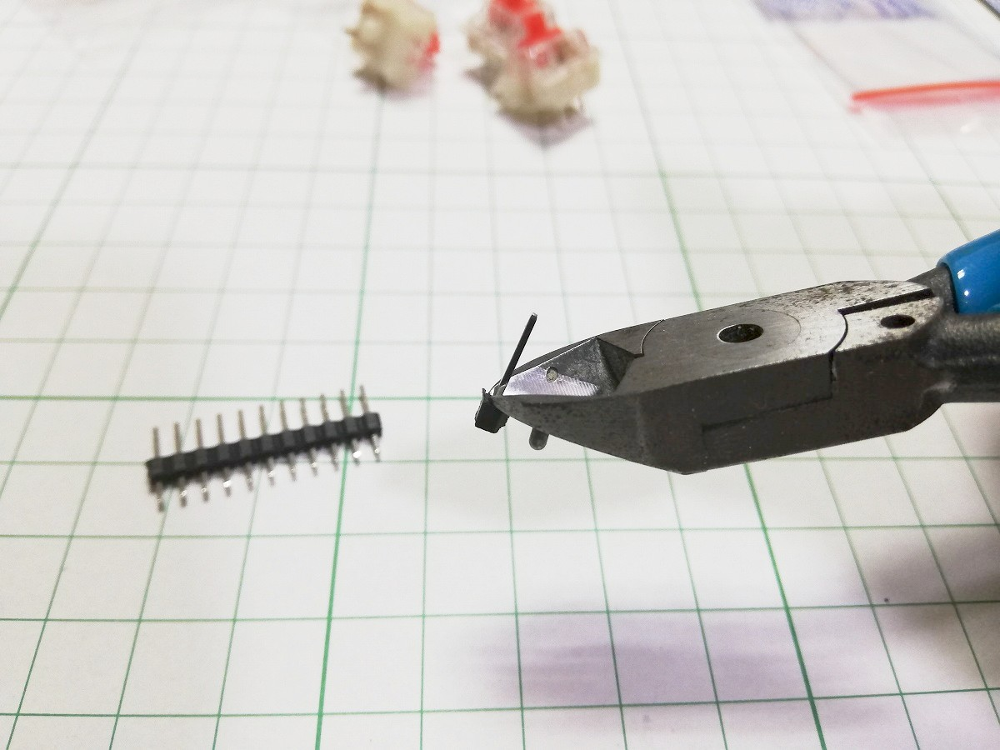

カットしたピンを、先ほど重ねた土台パーツの小さい穴に差し込み、一番下まで通します。
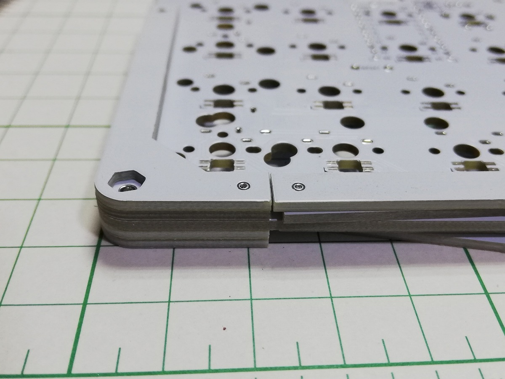

裏面からはんだ付けします。基板が浮かないように、押し付けながら行ってください。

裏返して表面からはんだ付けします。半田が盛り上がると上から枠パーツを重ねたときに隙間ができてしまうので、盛り上がらない程度に半田を少しだけ流し込んでください。もし半田を入れすぎたら、吸い取り線で吸って減らしてください。
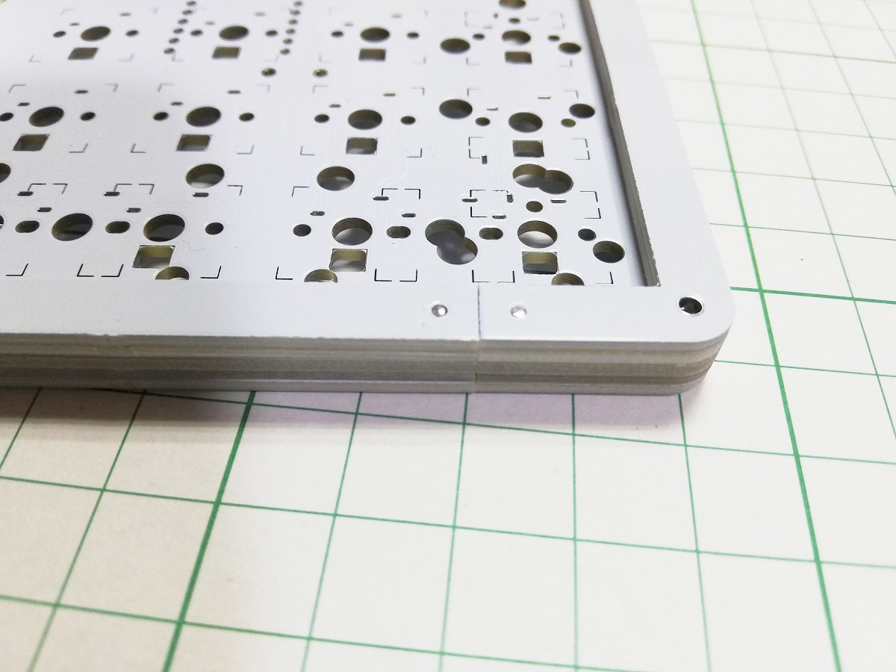

外周の8箇所について同様のことを行うと、土台が完成します。

表側から見た様子

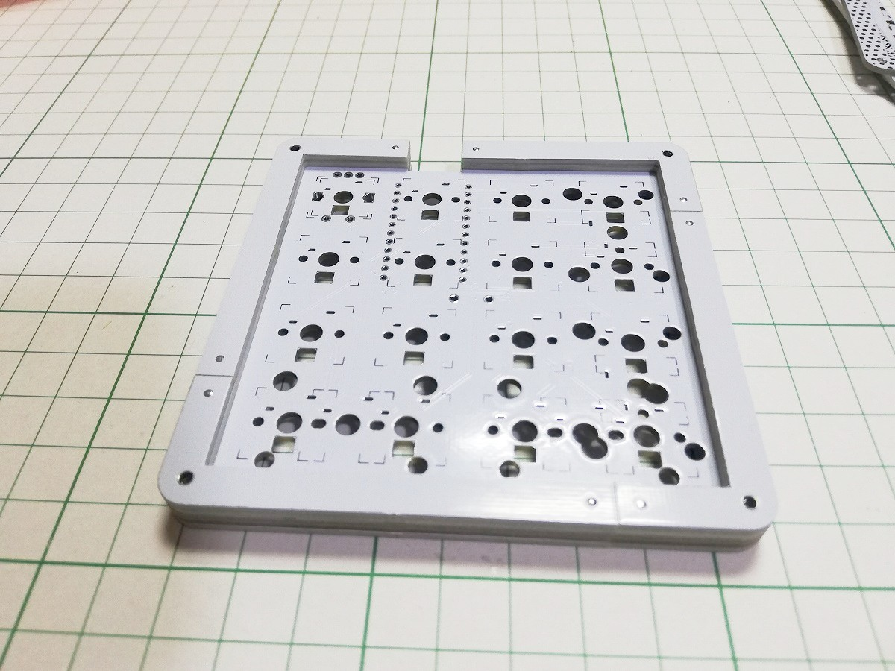

裏側から見た様子

### Pro Microの取り付け

**基板裏側**のPro Micro設置部分のスルーホールに、コンスルーピンヘッダを根本まで差し込みます。

その際、

- コンスルーピンヘッダの金色の窓が遠い側を基板側とし、金色の窓が近い側をProMicro側とする
- 金色の窓の向きを揃える

ようにしてください。

参考: [Helixベータ ビルドガイド](https://github.com/MakotoKurauchi/helix/blob/master/Doc/buildguide_jp.md#pro-micro)

ピンヘッダにPro Microを差し込みます。**Pro Microの裏面（平らなほう）が上になるように、またマイクロUSBが基板端になるように**します。

**向きを間違えるとリカバリーが大変です。表裏、左右をよく確認してください。**

Pro Microとコンスルーピンヘッダをハンダ付けします。まず四隅をハンダ付けし、横から見てコンスルーピンヘッダとの間に隙間があれば押さえながらハンダを温めて浮かないようにします。そのあと、順番に全てハンダ付けします。
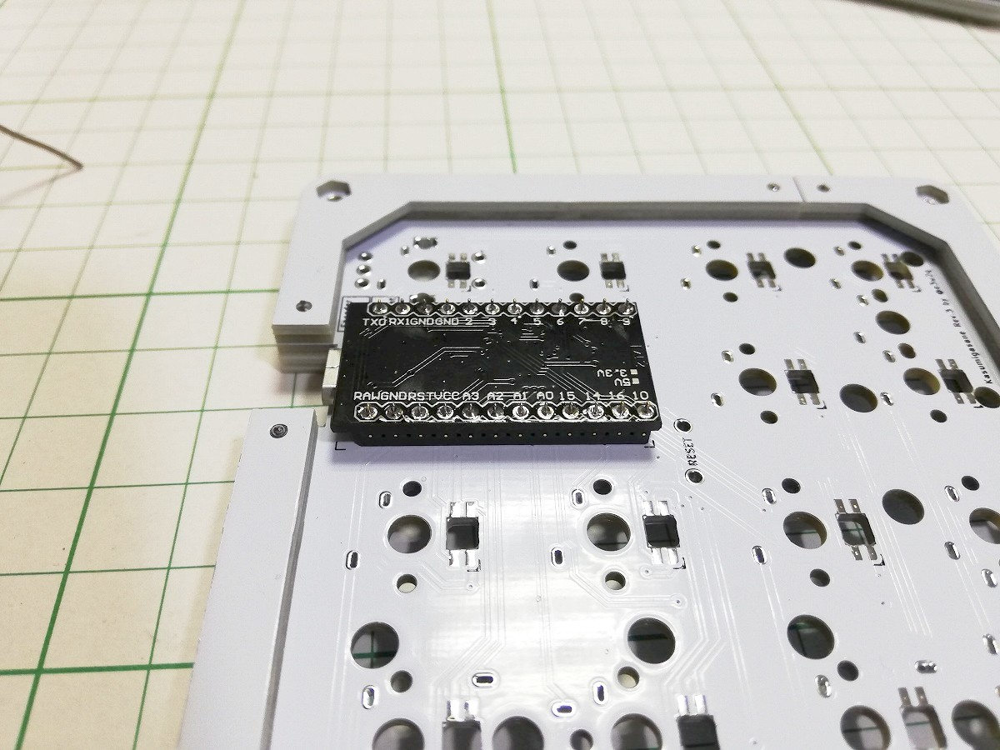

基板とコンスルーピンヘッダは接触しているため、ハンダ付けしません。

次に進む前に、一度Pro Microを基板から外します。

Pro Microの各ピンの穴に誤ってハンダが付かないように、マスキングテープでカバーしておくことをおすすめします。

### ダイオードの取り付け

このキーパッドはキーマトリクスを使わず、各キーがGPIOのピンに接続しているため、ダイオードのはんだ付けは不要です。

### バックライト用LEDの取り付け（バックライトで光らせたい場合のみ）

基板を裏返し、各スイッチにタブ付きのRGBLEDをはんだ付けします。基板の裏側から見たときに、LEDは裏側が見えるようにし、LEDのタブの欠けがシルクのL字と一致するように付けます。

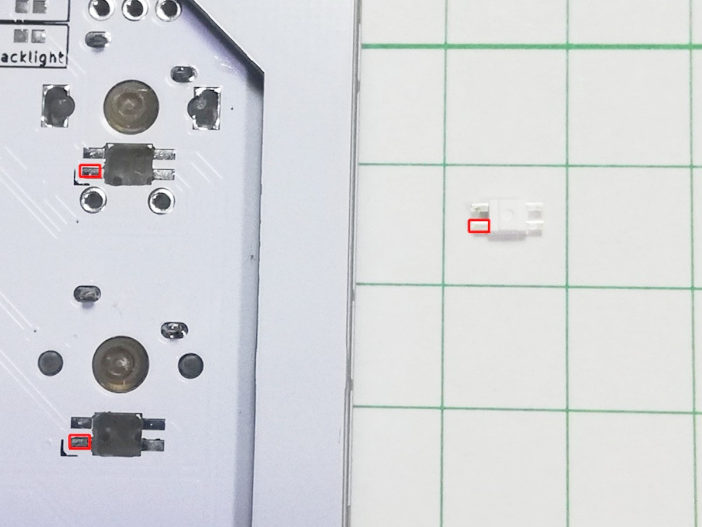

Backlightと書かれたジャンパをハンダで導通させます。

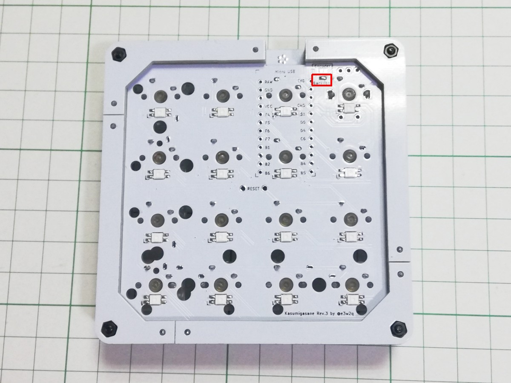

### ロータリーエンコーダの取り付け（ロータリーエンコーダを使いたい場合のみ）

右上のキーの位置にロータリーエンコーダを差し込み、はんだ付けします。一気にはんだ付けせず、まずは対角の2箇所をはんだ付けし、浮きがないことを確認してから残りをはんだ付けしてください。浮きがあれば、はんだを温めながら押すと直せます。

Encoderと書かれたジャンパをハンダで導通させます。

### スタビライザーの取り付け（2Uキーを使いたい場合のみ）

表側からスタビライザーを装着します。基板の穴の大小と、スタビライザーのポッチの大小を合わせてください。ネジ止めするタイプのスタビライザーの場合は、裏側からネジ止めします。

### キースイッチの取り付け

表側から差し込みます。トッププレート無しでもキースイッチのガタつきがないよう、穴のサイズを小さめにしてあります。ギュッと押し込んでください。キースイッチの足が曲がっている場合はまっすぐにしてから差し込んでください。

**Pro Microが取り付けられる部分のスイッチ2個は、差し込む前に端子をカットし、基板からはみ出さないようにしてください**

全部のキースイッチを差し込み終わったら、サイド方向からよく見て、スイッチが傾いていないか確認してください。
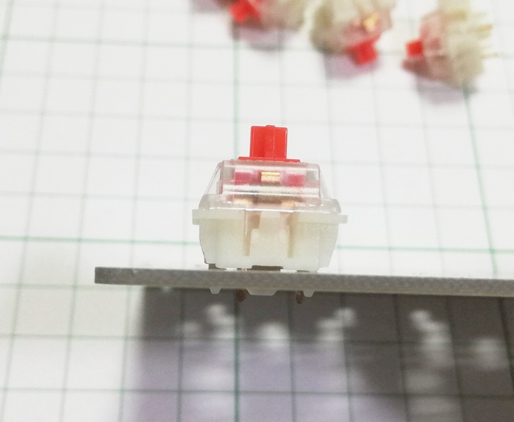

裏面もサイド方向からよく見て、キースイッチの固定用のピンの長さがどのキーも同じぐらい出ているか確認してください。

### 枠の組み立て

お好みの図柄が一番上になるようにして、枠パーツ4枚を表側に重ねます。
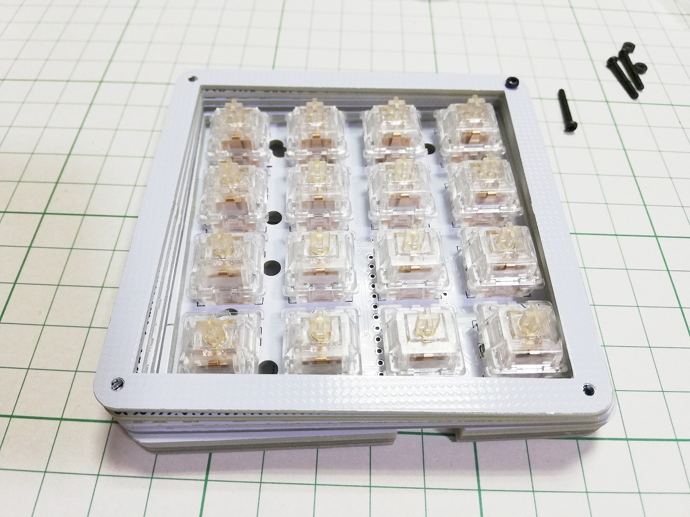

表からM2ネジ、裏にM2ナットを入れて固定します。

端面をやすりで磨くと段差が無くなります。

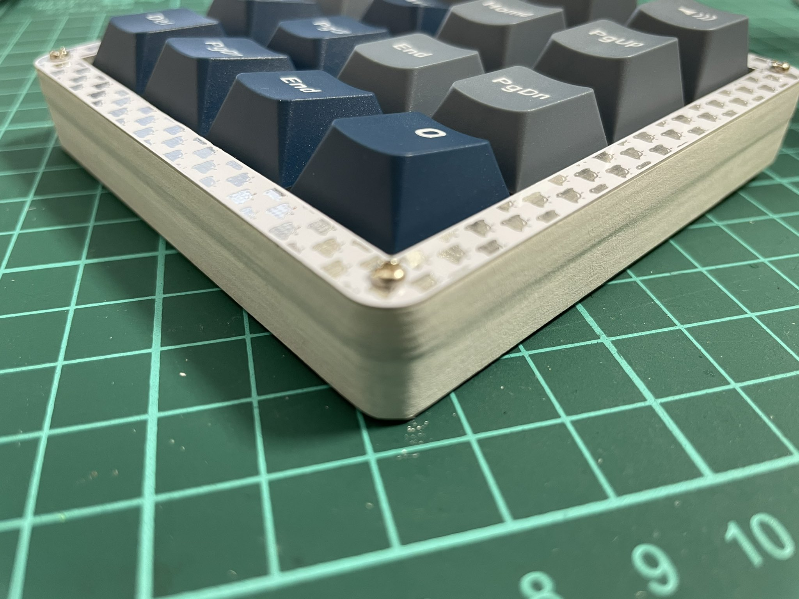

### マスキングテープの貼り付け

外周部分に、幅15mmの好きな柄のマスキングテープを貼り付けます。

外周部分は幅が大きいため、ガンダムマーカーやポスカではきれいに塗りにくいです。あと、塗料の場合、隙間に入り込むので枠を入れ替えするときに拭き取らないといけなかったりします。

側面を見栄えよくするポイント：

- マスキングテープテープでは側面の段差はあまりカバーできないので、もし重ねた基板の段差が気になるようなら、側面をヤスリがけしてください。
- マスキングテープは若干透けます。透けが気になる場合は、まず単色のマスキングテープを貼ってから、その上に好きな柄のマスキングテープを貼ると、ちょっとよくなります。
- マスキングテープの幅15mmに対して、側面の高さが14.4mmなので、ちょっとだけマスキングテープのほうが幅広です。マスキングテープは上面に合わせて貼って、下側のちょっとだけはみ出した部分を底面に折り込むとよいです。

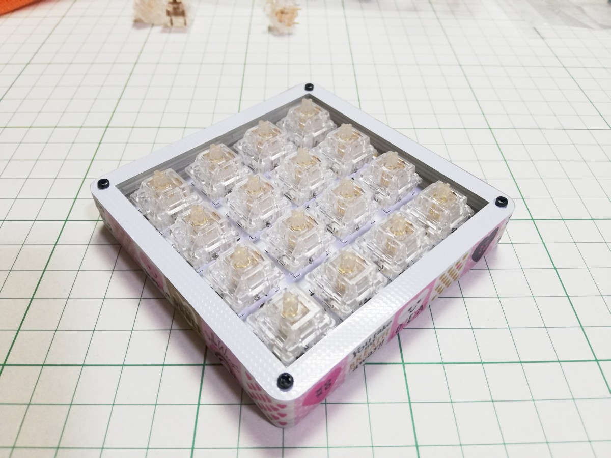

### Pro Microの再取り付け

裏からPro Microを再度取り付けます。
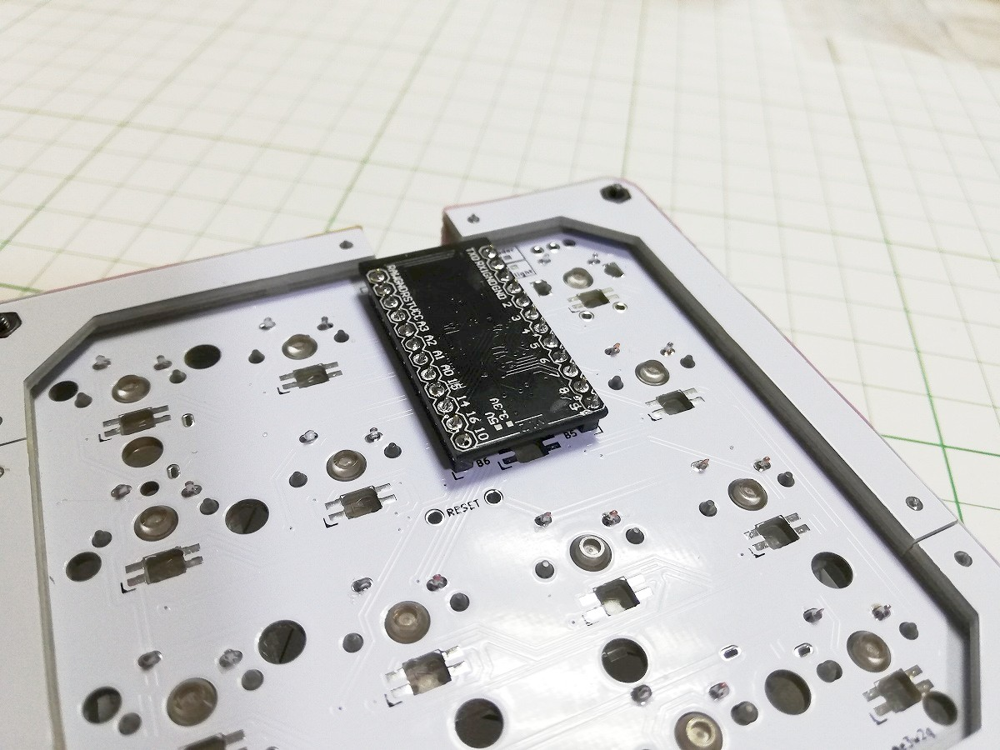

### カプトンテープの貼り付け（任意）

Pro Microが机に接触することはないように設計していますが、柔らかいデスクマットの上や膝の上や金属のテーブルの上で使用する場合は、Pro Microのピンの上にカプトンテープを貼ることをおすすめします。
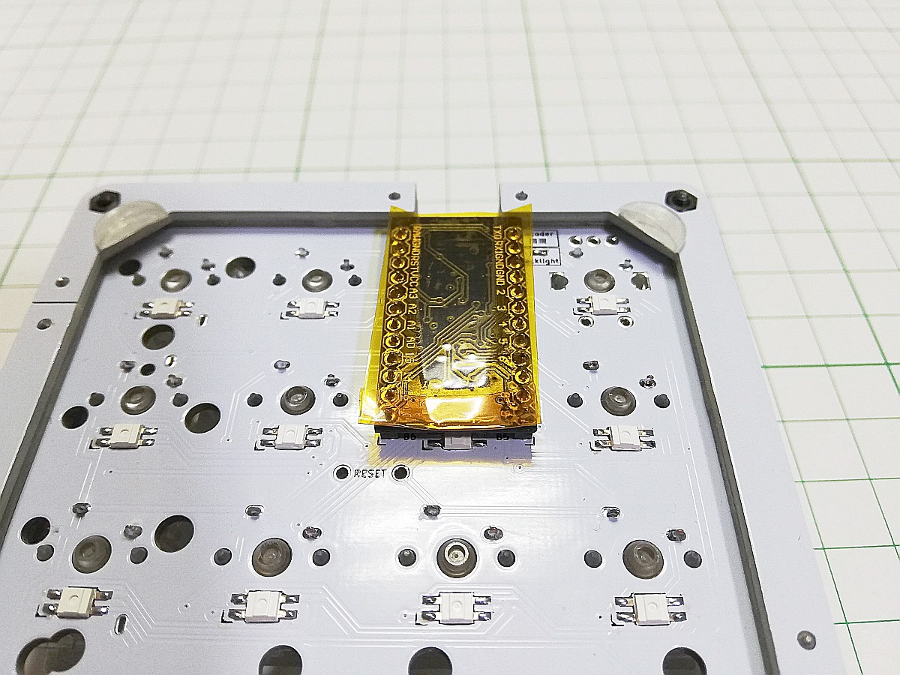

### キーキャップの取り付け

キースイッチにキーキャップをはめます。
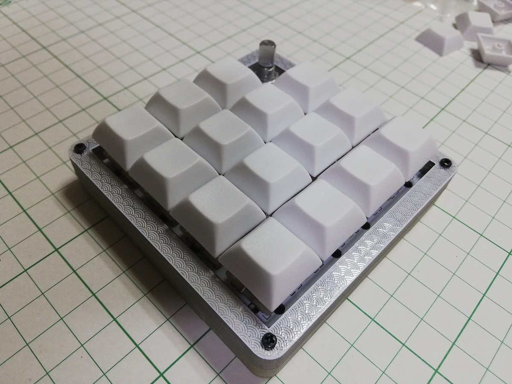

### ゴム足の取り付け

ゴム足を半分にカットして、裏面の四隅に取り付けます。

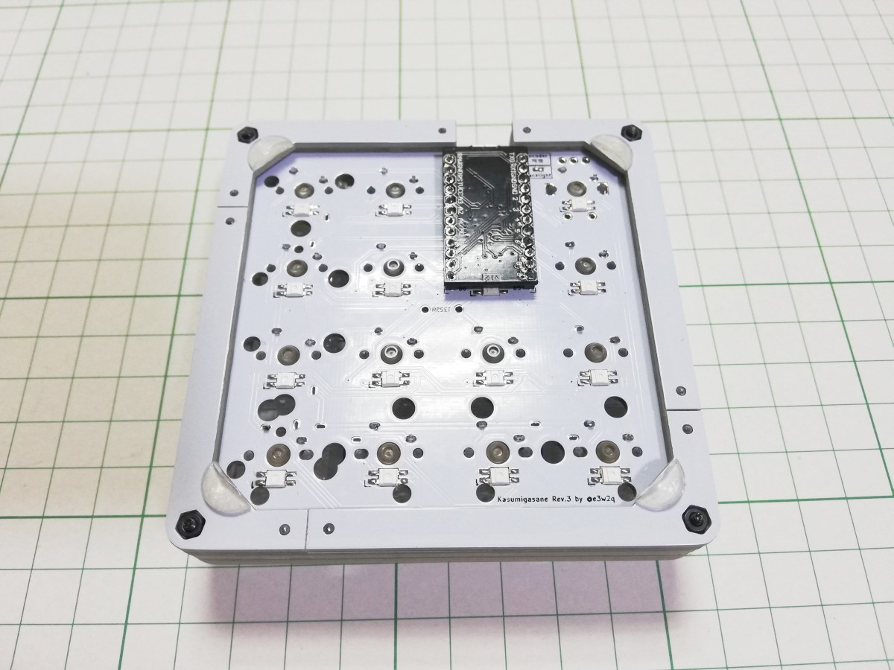

### ファームウェアの書き込み

[霞襲 ファームウェアの書き込み](firmware_jp.md)をご覧ください。

## トラブルシューティング

- 特定のキーが反応しない
  
  - キースイッチのハンダ付けが甘い場合があります。キースイッチを押すかわりに、キースイッチの裏面のハンダ2箇所をピンセットでショートさせてみて、入力されるか確認してください。入力される場合は、ハンダ付けし直してみてください。
- バックライトLEDが点灯しない
  
  - 以下のページが参考になります。
  
    [[自作キーボード]LEDがつかない/光らないときに見るページ - Qiita](https://qiita.com/tez/items/03c2daec5d3aed8dd558)

